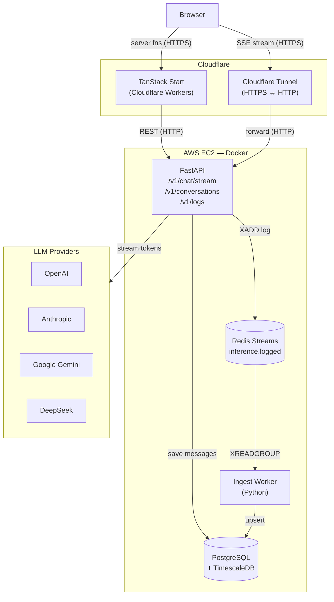
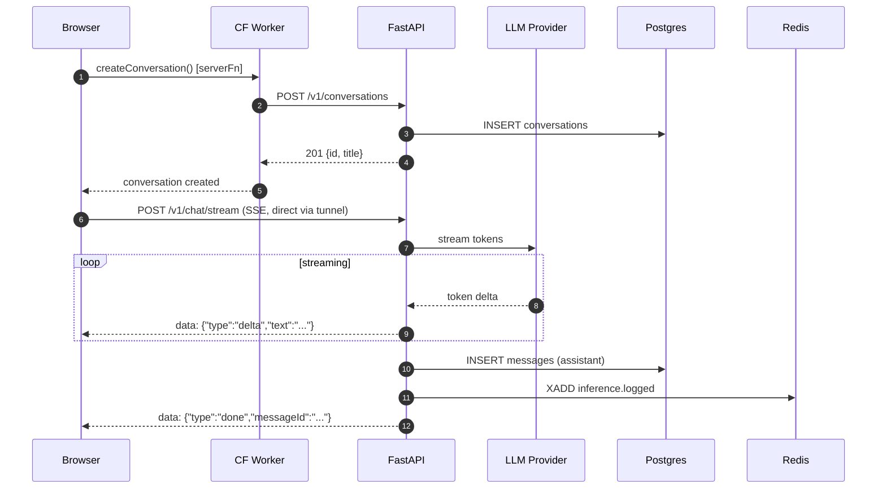
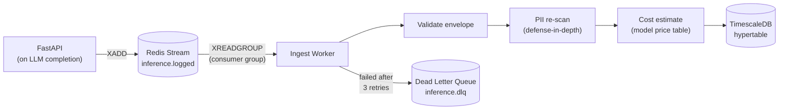
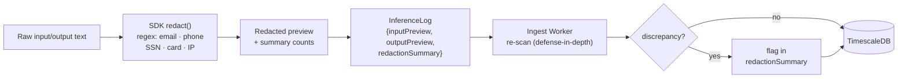

# something.chat

## Architecture Overview

### System diagram



### Chat request flow



### Ingestion pipeline



### PII redaction flow



## Repository Layout

```
something.chat/
├── apps/
│   ├── web/              # TanStack Start (React SSR) — Cloudflare Workers
│   └── api/              # FastAPI — chat streaming, ingestion, CRUD
├── packages/
│   ├── sdk/              # TypeScript SDK — provider adapters + PII redaction + log emitter
│   └── examples/         # SDK usage examples (basic, streaming, cancel, multi-provider)
├── workers/
│   └── ingest/           # Python consumer — Redis → Postgres/TimescaleDB
├── infra/
│   └── docker-compose.yml
├── docs/
│   └── architecture.md
└── justfile              # task runner
```

## Setup Instructions
1. Clone and Configure
```bash
git clone https://github.com/YOUR_USERNAME/something.chat.git
cd something.chat

cp .env.example apps/web/.dev.vars
# Fill in at least one LLM API key:
#   GOOGLE_API_KEY=AIza...
#   OPENAI_API_KEY=sk-...
#   ANTHROPIC_API_KEY=sk-ant-...
```
2. Run everything
```bash
just setup        # installs deps + builds Docker images + runs migrations + starts all services
just dev-web      # start the web dev server (separate terminal)
```

## Schema Design
used TimescaleDB(wrapper around postgres)
```sql
conversations (
    id               UUID PRIMARY KEY,
    title            TEXT,
    model_default    TEXT,
    provider_default TEXT,
    status           TEXT CHECK (status IN ('active', 'archived', 'cancelled')),
    created_at       TIMESTAMPTZ,
    updated_at       TIMESTAMPTZ
)

messages (
    id               UUID PRIMARY KEY,
    conversation_id  UUID REFERENCES conversations(id) ON DELETE CASCADE,
    role             TEXT CHECK (role IN ('user', 'assistant', 'system')),
    content          TEXT,
    inference_log_id TEXT,    -- links assistant message → its inference log
    created_at       TIMESTAMPTZ
)
```

**Why Postgres for chat?** Messages are relational (foreign keys, cascading deletes), small in volume per user, and benefit from transactional guarantees. Standard OLTP workload

### inference telemetry

```sql
inference_logs (
    request_id        TEXT,
    conversation_id   UUID,
    provider          TEXT,
    model             TEXT,
    status            TEXT CHECK (status IN ('ok', 'error', 'cancelled')),
    started_at        TIMESTAMPTZ NOT NULL,   -- partition key
    finished_at       TIMESTAMPTZ,
    latency_ms        INTEGER,
    ttft_ms           INTEGER,               -- time to first token
    prompt_tokens     INTEGER,
    completion_tokens INTEGER,
    total_tokens      INTEGER,
    cost_usd          NUMERIC(12,6),
    input_preview     TEXT,                  -- PII-redacted
    output_preview    TEXT,                  -- PII-redacted
    redaction_summary JSONB,
    sdk_version       TEXT
)
-- Hypertable: partitioned by started_at, 1-day chunks
-- Unique index: (request_id, started_at) — required by TimescaleDB
```

**Why TimescaleDB for telemetry?** Inference logs are wide, append-only, and queried by time window. TimescaleDB gives automatic chunk management, continuous aggregates for sub-second dashboard queries, and native SQL (no new query language)

**Why split the two stores?** Chat is relational and tiny per conversation; telemetry is columnar and grows unboundedly. Forcing both into a single schema either bloats the chat indexes or kneecaps time-series queries

## Tradeoffs

| Decision | Choice | Tradeoff |
|---|---|---|
| **Event bus** | Redis Streams | Simpler ops than Kafka; no ZooKeeper; ~1M XADD/s single node. Loses cross-region replication. Swap is one interface away. |
| **Telemetry DB** | TimescaleDB | Same Postgres wire protocol; simpler ops than ClickHouse. ClickHouse would be faster at 100M+ rows. |
| **LLM calls** | Python adapters in FastAPI | Avoids TanStack Start streaming complexity with Cloudflare Workers. Costs a Python reimplementation of the TS SDK patterns. |
| **SDK language** | TypeScript | Matches the frontend stack; runs in browser/Worker contexts. Python callers need the FastAPI endpoint instead of the SDK directly. |
| **PII redaction** | Two-stage (SDK + Worker) | Defense-in-depth: SDK redacts before the log leaves the process; Worker re-scans to catch stale SDK clients. Adds a small compute cost. |
| **Cancellation** | AbortController → status=cancelled | Full cancel propagates to the LLM provider stream. Partial token count is logged; cost estimate may be slightly off. |
| **Auth** | None (demo) | No user accounts simplifies the demo but is a hard blocker for production. Would add Cloudflare Access or Convex Auth. |
| **Cloudflare Tunnel** | Quick tunnel (trycloudflare.com) | Zero config, free. URL changes on restart. Production should use a named tunnel with a stable subdomain. |

## Tech Stack

| Layer | Technology |
|---|---|
| Frontend | TanStack Start (React 19, SSR), Cloudflare Workers |
| Styling | Tailwind CSS v4, shadcn/ui primitives, OpenChat design system |
| SDK | TypeScript, vitest |
| Backend API | Python 3.13, FastAPI, asyncpg |
| Chat streaming | FastAPI `StreamingResponse` (SSE), Python LLM adapters |
| Ingestion pipeline | Python worker, Redis Streams consumer group |
| OLTP database | PostgreSQL 16 (TimescaleDB extension) |
| OLAP telemetry | TimescaleDB hypertable |
| Event bus | Redis 7 Streams |
| Package managers | pnpm (JS), uv (Python) |
| Infrastructure | Docker Compose, AWS EC2, Cloudflare Tunnel |
| Task runner | just |
