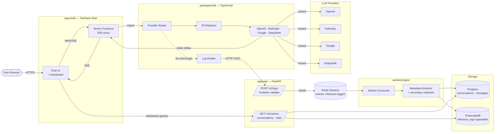
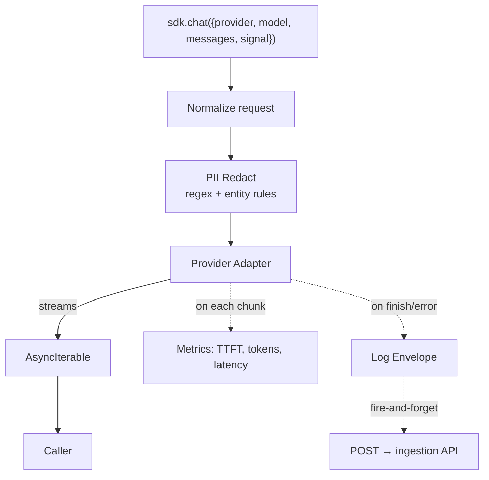
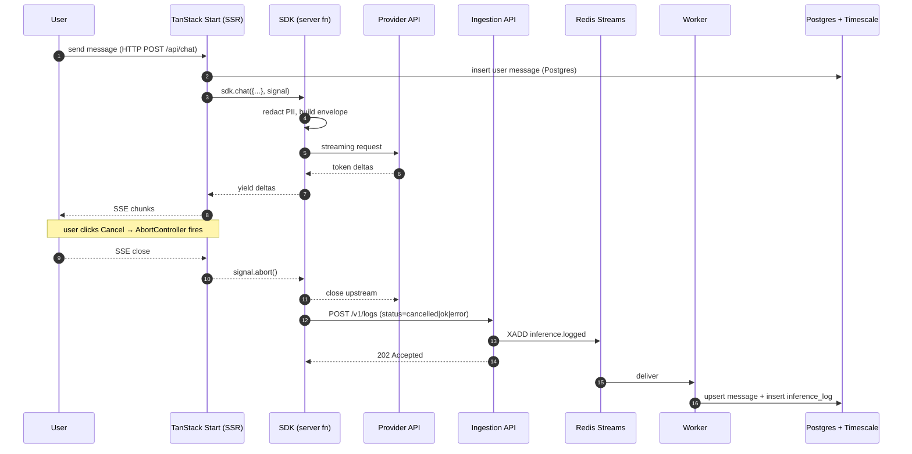

# something.chat — Architecture

> Lightweight, multi-provider LLM chat + inference observability.
> Monorepo. One `docker compose up`. Spec: [spec.md](./spec.md).

---

## 1. Guiding Principles

1. **One repo, one command.** Frontend, SDK, ingestion, workers, DBs all live together and boot with `docker compose up`.
2. **The SDK is the seam.** Every LLM call goes through one TypeScript wrapper — no provider SDK is imported anywhere else. That single chokepoint gives us logging, redaction, retries, cancellation, and provider-portability for free.
3. **Hot path stays fast; observability is async.** Chat requests must never block on the log pipeline. Logs are fire-and-forget over an event bus; failure to log never fails a chat.
4. **OLTP for chat, OLAP for telemetry.** Conversations live in Postgres (transactional, relational). Inference logs live in a columnar store (TimescaleDB hypertable) optimized for time-series dashboards.
5. **Redact before it leaves the process.** PII redaction runs inside the SDK *before* the log envelope is sealed. The ingestion layer re-scans as defense-in-depth, but the source of truth is the SDK.

---

## 2. One-Repo Layout

```
something.chat/
├── apps/
│   ├── web/                 # TanStack Start — chat UI + dashboard (one app, two routes)
│   └── api/                 # Python FastAPI — ingestion + dashboard query API
├── packages/
│   └── sdk/                 # TypeScript — llm-observe SDK (provider adapters + logger)
├── workers/
│   └── ingest/       # Python — consumes event bus, writes DBs, extracts metadata
├── infra/
│   ├── docker-compose.yml   # postgres, timescale, redis, api, worker, web
│   ├── k8s/                 # Helm chart for self-hosted k8s (bonus)
│   └── migrations/          # Alembic
└── docs/
    ├── spec.md
    └── architecture.md      # ← you are here
```

The SDK is consumed by `apps/web`'s **TanStack Start server functions** — never the browser — so provider API keys stay server-side and the SDK can talk to the ingestion API over the internal network.

---

## 3. System Diagram (High Level)



---

## 4. Component Responsibilities

### 4.1 `apps/web` — TanStack Start (frontend + BFF)

One app, two surfaces:

| Route                       | Purpose                                                   |
| --------------------------- | --------------------------------------------------------- |
| `/`                         | Conversation list (sidebar) + chat pane                   |
| `/c/$conversationId`        | Resume a conversation                                     |
| `/dashboard`                | Latency / throughput / error charts                       |
| `/api/chat` (server fn)     | SSE proxy → calls SDK → streams tokens back               |
| `/api/conversations/*`      | CRUD over conversations (Postgres via FastAPI)            |

**Why TanStack Start:** isomorphic React with first-class server functions. We get SSR for the chat list, an SSE endpoint for streaming, and zero need for a second Node service. Server functions are the *only* place the SDK is imported — keys never reach the browser.

**Frontend features delivered (bonus checklist):**
- ✅ Model picker (provider/model switch mid-conversation)
- ✅ Streaming bubbles via SSE + `ReadableStream`
- ✅ **Cancel** — `AbortController` propagated SDK → provider → SSE close
- ✅ **List** conversations — virtualized sidebar, paginated from Postgres
- ✅ **Resume** — load message history on route mount

### 4.2 `packages/sdk` — TypeScript LLM SDK

The thin wrapper. Single public API; pluggable adapters.



**Captured metadata (per call):**
`request_id`, `conversation_id`, `session_id`, `provider`, `model`, `started_at`, `finished_at`, `latency_ms`, `ttft_ms`, `prompt_tokens`, `completion_tokens`, `total_tokens`, `status` (`ok`/`error`/`cancelled`), `error_code`, `error_message`, `input_preview` (first/last N chars, redacted), `output_preview` (redacted), `redaction_summary` (counts per PII class), `sdk_version`, `client_ip_hash`.

**Adapters** implement one interface:

```ts
interface ProviderAdapter {
  name: 'openai' | 'anthropic' | 'google' | 'deepseek';
  stream(req: NormalizedRequest, signal: AbortSignal): AsyncIterable<TokenDelta>;
  countTokens(text: string, model: string): number;
}
```

**Reliability:** the log emitter has an in-memory bounded queue + exponential backoff. If ingestion is down, it drops oldest after N retries — chat path stays unaffected.

### 4.3 `apps/api` — FastAPI (Python)

Two responsibilities, intentionally narrow:

1. **Ingestion** (`POST /v1/logs`): Pydantic-validate the envelope, attach server-side timestamp + ip-hash, `XADD` to Redis Stream `inference.logged`. Returns `202 Accepted` immediately.
2. **Query** (`GET /v1/conversations`, `GET /v1/metrics/*`): reads from Postgres + TimescaleDB for the UI and dashboard.

No business logic on the write path. Validation only. Backpressure handled by Redis bounded stream length (`MAXLEN ~`).

### 4.4 `workers/ingest` — Python consumer

Consumer group on `inference.logged`. Per message:

1. Re-validate envelope (defense in depth).
2. Re-run PII redaction on previews (catch SDKs running stale rules).
3. Extract derived metadata: tokens/sec, cost estimate (model price table), conversation rollups.
4. Upsert message row in Postgres (if `message_id` present).
5. Insert inference log row in TimescaleDB hypertable.
6. `XACK` on success; failed messages → dead-letter stream `inference.dlq`.

Horizontally scalable: add replicas, Redis consumer-group does the sharding.

### 4.5 Storage

**Postgres — transactional chat data**

```
conversations(id, user_id, title, model_default, created_at, updated_at, status)
messages(id, conversation_id, role, content, created_at, parent_message_id,
         inference_log_id /* nullable, links assistant msg → its log */)
```

**TimescaleDB — inference telemetry** (hypertable, partitioned by `started_at`)

```
inference_logs(
  request_id PK, conversation_id, message_id, user_id,
  provider, model, status, error_code,
  started_at, finished_at, latency_ms, ttft_ms,
  prompt_tokens, completion_tokens, total_tokens, cost_usd,
  input_preview, output_preview, redaction_summary JSONB,
  sdk_version, raw_envelope JSONB
)
-- continuous aggregates for the dashboard (1m / 5m / 1h buckets)
```

**Why split:** chat is relational and small (rows ≈ messages). Telemetry is wide, append-only, time-series, and queried by time-window aggregations. Forcing both into one Postgres table either burdens OLTP indexes or kneecaps dashboard queries. Timescale gives us continuous aggregates for sub-second dashboard rendering at any scale.

---

## 5. Request Lifecycle



---

## 6. Event-Driven Backbone

Redis Streams chosen over Kafka for this scale: persistent, consumer groups, single container, no ZooKeeper. Topic shape:

| Stream                 | Producer       | Consumer            | Purpose                              |
| ---------------------- | -------------- | ------------------- | ------------------------------------ |
| `inference.logged`     | Ingestion API  | ingest       | Primary telemetry pipeline           |
| `inference.dlq`        | ingest  | ops dashboard       | Failed messages, manual replay       |
| `conversation.events`  | web server fn  | ingest (opt) | Title-generation, summarization jobs |

Swap-out path: Redis Streams → NATS JetStream → Kafka, all behind a thin publisher interface. We commit to the *pattern*, not the broker.

---

## 7. PII Redaction

Two-stage:

1. **SDK (authoritative):** regex pack (emails, phones, SSN, IPs, credit cards) + a pluggable detector hook (Presidio-compatible interface). Runs on `input_preview` and `output_preview` *before* the envelope leaves the process. Originals are never stored; only redacted previews + a `redaction_summary` counter.
2. **Worker (defense-in-depth):** same rule set re-applied. Catches stale clients. Mismatch → flag in `redaction_summary.discrepancy=true` for audit.

Full message bodies in Postgres are stored **redacted by default**. A feature flag (`STORE_RAW_BODIES=false`) controls whether we keep originals; off for production demo.

---

## 8. Failure Handling

| Failure                       | Behavior                                                                   |
| ----------------------------- | -------------------------------------------------------------------------- |
| Provider 5xx / timeout        | SDK retries with backoff (idempotent only); surfaces error to UI; logs `status=error` |
| Provider rate limit           | SDK exposes `retry_after`; UI shows toast; logs `status=error,error_code=429` |
| Ingestion API down            | SDK queues in memory, retries, drops oldest after cap — **chat unaffected** |
| Redis down                    | Ingestion API returns 503; SDK queues; on recovery, drains queue           |
| Worker crash                  | Consumer group redelivers unacked messages; idempotent upsert by `request_id` |
| Worker poisoned message       | After N retries → `inference.dlq` with original envelope                   |
| User cancels                  | AbortSignal cascades; log written with `status=cancelled` and partial tokens |
| Frontend reload mid-stream    | Server function detects disconnect, aborts upstream, logs `status=cancelled` |

**Idempotency:** every write keyed on `request_id` (UUIDv7 generated in SDK). Re-delivery is safe.

---

## 9. Scaling Considerations

- **Web (TanStack Start):** stateless behind a load balancer; sticky sessions only needed for SSE — solved with consistent hashing on `conversation_id` or accepting any node + Redis pub/sub for cross-node cancellation (not required at MVP).
- **Ingestion API:** stateless, horizontally scalable; bottleneck is Redis `XADD` throughput (~1M/s on a single node, far above demo needs).
- **Workers:** scale by adding consumer-group members. Redis shards the load.
- **Postgres:** read replicas for the conversations list; primary handles writes. Conversation tables are bounded by users × messages — trivially small.
- **TimescaleDB:** hypertable chunks by 1-day intervals; continuous aggregates roll up to 1m/5m/1h pre-computed buckets so the dashboard reads from materialized views, not raw rows.
- **Providers:** SDK keeps per-provider concurrency limits + circuit breaker. One bad provider can't starve others.

---

## 10. Dashboard

Same TanStack Start app, route `/dashboard`. Queries hit FastAPI `/v1/metrics/*` endpoints which read TimescaleDB **continuous aggregates** (not raw rows). Charts:

| Chart                | Source                                            |
| -------------------- | ------------------------------------------------- |
| p50/p95/p99 latency  | `cagg_latency_1m` by provider & model             |
| TTFT                 | `cagg_ttft_1m`                                    |
| Throughput (req/s)   | `cagg_requests_1m`                                |
| Error rate           | `cagg_status_1m` (group by status)                |
| Token throughput     | `cagg_tokens_1m`                                  |
| Cost per provider    | derived from token counts × price table           |

---

## 11. Deployment

- **Local / demo:** `docker compose up` → `web`, `api`, `worker`, `postgres`, `timescaledb`, `redis`. One command, full stack.
- **k8s (bonus):** Helm chart in `infra/k8s/`. Deployments for web/api/worker; StatefulSets for postgres/timescale/redis (or use managed equivalents). HPA on api + worker CPU. Ingress → web. Secrets via sealed-secrets. Targeted at a self-hosted cluster (k3s/Talos).
- **Demo link:** web exposed via ingress + Caddy; Loom recording of cancel + resume + dashboard.

---

## 12. Trade-offs Made

1. **Redis Streams over Kafka** — simpler, fewer containers, enough durability for this scale. Loses cross-region replication and multi-day retention. Acceptable for MVP; swap is one interface away.
2. **TimescaleDB over ClickHouse** — Postgres-native, single SQL dialect, simpler ops. ClickHouse would be faster at 100M+ rows but adds another data store and another query language.
3. **SDK in TypeScript only** — frontend stack is TS, server functions are TS, so one language covers chat path. Python SDK for backend-only callers is a follow-up; ingestion is language-agnostic HTTP.
4. **No browser-side SDK** — keeps API keys and redaction rules server-side. Costs a network hop but eliminates a class of leaks.
5. **Single repo, no microservices** — easier to demo, easier to reason about. The event bus already gives us the seams to split later.

---

## 13. What This Buys Us

Every spec deliverable + every bonus, in one repo, one command, one mental model:

| Spec / Bonus item               | Where it lives                                       |
| ------------------------------- | ---------------------------------------------------- |
| Multi-turn chatbot UI           | `apps/web` chat route                                |
| Lightweight SDK / wrapper       | `packages/sdk`                                       |
| Ingestion API                   | `apps/api` `/v1/logs`                                |
| DB storage (chat + logs + meta) | Postgres + TimescaleDB                               |
| Multi-provider support          | SDK adapters                                         |
| Streaming responses             | SDK `AsyncIterable` → SSE → UI                       |
| Latency/throughput/error dash   | `/dashboard` + Timescale CAGGs                       |
| Docker Compose one-command      | `infra/docker-compose.yml`                           |
| Event-based architecture        | Redis Streams                                        |
| PII redaction                   | SDK (authoritative) + worker (defense-in-depth)      |
| Self-hosted k8s deploy          | `infra/k8s/` Helm chart                              |
| Frontend cancel/list/resume     | `apps/web` + AbortController + Postgres history      |
